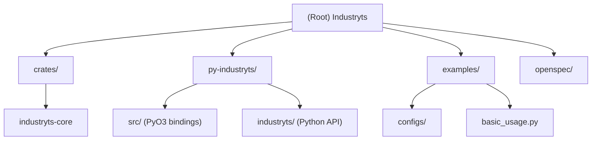

<!-- OPENSPEC:START -->
# OpenSpec Instructions

These instructions are for AI assistants working in this project.

Always open `@/openspec/AGENTS.md` when the request:
- Mentions planning or proposals (words like proposal, spec, change, plan)
- Introduces new capabilities, breaking changes, architecture shifts, or big performance/security work
- Sounds ambiguous and you need the authoritative spec before coding

Use `@/openspec/AGENTS.md` to learn:
- How to create and apply change proposals
- Spec format and conventions
- Project structure and guidelines

Keep this managed block so 'openspec update' can refresh the instructions.

<!-- OPENSPEC:END -->

# Industryts - AI Context Documentation

**Last Updated:** 2025-11-04 14:47:17 CST

## Change Log

### 2025-11-04 14:47:17 CST
- Initial AI context documentation created
- Documented Rust core library (industryts-core) structure and capabilities
- Documented Python bindings (py-industryts) architecture
- Identified module structure and key interfaces
- Coverage: Core operations implemented (cleaning, features, transform), resample operation pending Polars 0.51 API update

---

## Project Vision

Industryts is a high-performance time series processing library for industrial data, delivering 10-100x performance improvements over pandas through a Rust-powered core and Polars-based columnar processing. The library provides dual APIs (programmatic Python and declarative TOML) for flexible data processing pipelines.

**Core Goals:**
- **Performance**: Leverage Rust's zero-cost abstractions and Polars' columnar processing for maximum speed
- **Developer Experience**: Provide Python-friendly API with full type hints and familiar patterns
- **Flexibility**: Support both programmatic (Python) and declarative (TOML) pipeline construction
- **Industrial Focus**: Optimize for common industrial time series patterns (resampling, lag features, cleaning)
- **Type Safety**: Use Rust's type system to catch errors at compile time

**Target Use Cases:**
- Industrial sensor data processing and cleaning
- Time series feature engineering for ML pipelines
- High-frequency data resampling and aggregation
- Real-time data transformation in production environments

---

## Architecture Overview

Industryts follows a three-layer architecture inspired by Polars:

```
┌─────────────────────────────────────────────────────────┐
│  Python API Layer (py-industryts/industryts/)           │
│  - TimeSeriesData, Pipeline classes                     │
│  - I/O helpers (CSV, Parquet)                           │
│  - Type hints and documentation                         │
└────────────────────┬────────────────────────────────────┘
                     │
┌────────────────────▼────────────────────────────────────┐
│  PyO3 Bindings (py-industryts/src/)                     │
│  - Python-Rust bridge via PyO3                          │
│  - pyo3-polars for zero-copy DataFrame sharing          │
└────────────────────┬────────────────────────────────────┘
                     │
┌────────────────────▼────────────────────────────────────┐
│  Rust Core (crates/industryts-core/)                    │
│  - TimeSeriesData struct                                │
│  - Operation trait and implementations                  │
│  - Pipeline orchestration                               │
│  - Polars DataFrame operations                          │
└─────────────────────────────────────────────────────────┘
```

**Key Design Patterns:**
- **Separation of Concerns**: Pure Rust core library (industryts-core) for business logic, separate Python bindings (py-industryts)
- **Zero-Copy Data Transfer**: pyo3-polars enables efficient DataFrame sharing between Python and Rust
- **Trait-Based Operations**: `Operation` trait allows composable, type-safe pipeline building
- **Configuration-Driven**: TOML-based declarative pipelines for reproducible workflows
- **Lazy Evaluation Potential**: Built on Polars' lazy evaluation capabilities (future enhancement)

---

## Module Structure Diagram



---

## Module Index

| Module Path | Language | Purpose | Key Interfaces |
|-------------|----------|---------|----------------|
| [`crates/industryts-core/`](crates/industryts-core/CLAUDE.md) | Rust | Core time series processing library with Polars integration | `TimeSeriesData`, `Pipeline`, `Operation` trait, operation implementations |
| [`py-industryts/`](py-industryts/CLAUDE.md) | Rust+Python | Python bindings via PyO3 and high-level Python API | PyO3 wrappers, Python classes with type hints, I/O helpers |
| `examples/` | Python+TOML | Usage examples and configuration templates | `basic_usage.py`, pipeline configs |
| `openspec/` | Markdown | OpenSpec change management system | Proposals, specs, tasks |

---

## Running and Development

### Prerequisites
- **Rust**: 1.70+ (for Rust core and PyO3 bindings)
- **Python**: 3.9+ (target compatibility: 3.9-3.13)
- **uv**: Recommended package manager for Python development

### Development Setup

```bash
# Clone repository
git clone <repository-url>
cd Industryts

# Install uv (if not installed)
curl -LsSf https://astral.sh/uv/install.sh | sh

# Build and install in development mode (fast compile, debug symbols)
make develop
# Or: uv run maturin develop

# Run tests
make test

# Type checking
make typecheck

# Linting and formatting
make lint
make format
```

### Build Commands

See `Makefile` for complete list:
- `make develop` - Fast development build with debug symbols
- `make build` - Release build with optimizations
- `make test` - Run Rust and Python tests
- `make bench` - Run benchmarks
- `make clean` - Clean build artifacts

### Testing Strategy

**Current Status**: No test files found during initialization. Testing infrastructure needs to be added.

**Recommended Test Structure**:
```
crates/industryts-core/
  tests/               # Rust integration tests
  src/*/tests          # Rust unit tests (inline)

py-industryts/
  tests/
    test_timeseries.py
    test_pipeline.py
    test_operations.py
    test_io.py
```

**Test Categories**:
- **Rust Unit Tests**: Inline tests in source files (see `timeseries.rs`, `cleaning.rs`)
- **Rust Integration Tests**: Test operation pipelines, config parsing
- **Python Unit Tests**: Test Python API wrapper behavior
- **Python Integration Tests**: End-to-end pipeline tests with real data
- **Benchmarks**: Performance comparisons with pandas (Criterion for Rust, pytest-benchmark for Python)

---

## Coding Standards

### Rust Code (crates/industryts-core/, py-industryts/src/)

**Style**:
- Follow Rust 2021 edition conventions
- Use `rustfmt` for formatting (run `cargo fmt`)
- Use `clippy` for linting (run `cargo clippy -- -D warnings`)
- Maximum line length: 100 characters

**Patterns**:
- Prefer `?` operator for error propagation over explicit `match`
- Use custom error types via `thiserror` crate
- Document public APIs with `///` doc comments
- Include examples in doc comments where helpful
- Use `#[derive]` macros for common traits

**Error Handling**:
- Use `Result<T, IndustrytsError>` for fallible operations
- Define semantic error variants in `error.rs`
- Convert external errors (Polars, IO, TOML) to `IndustrytsError`

**Testing**:
- Write unit tests with `#[cfg(test)]` modules
- Use Criterion for benchmarks
- Test edge cases: empty DataFrames, null values, type mismatches

### Python Code (py-industryts/industryts/)

**Style**:
- Follow PEP 8 conventions
- Use `ruff` for linting and formatting
- Type hints required for all public APIs (PEP 484)
- Maximum line length: 100 characters

**Type Hints**:
- Use `from __future__ import annotations` for forward references
- Annotate all function parameters and return types
- Use `Optional[T]` for nullable types
- Use `pl.DataFrame` for Polars DataFrame types

**Documentation**:
- Google-style docstrings for all public APIs
- Include Args, Returns, Raises sections
- Provide usage examples in docstrings
- Keep docstrings concise but informative

**Testing**:
- Use `pytest` for all tests
- Use `hypothesis` for property-based testing
- Use `pytest-benchmark` for performance tests
- Test type hints with `mypy` and `pyright`

### Configuration Files (TOML)

**Structure**:
- Use lowercase keys for consistency
- Group related configuration under sections
- Document expected types and valid values in comments
- Provide example configs in `examples/configs/`

**Validation**:
- Validate all config files on load
- Provide clear error messages for invalid configs
- Use `serde` for serialization/deserialization in Rust

---

## AI Usage Guidelines

### When Making Changes

1. **Read Module Documentation First**: Always read the relevant module's `CLAUDE.md` before modifying code
2. **Check OpenSpec**: For architectural changes, check `openspec/AGENTS.md` for proposals and specs
3. **Preserve Type Safety**: Maintain Rust type safety and Python type hints
4. **Test Coverage**: Add tests for new functionality
5. **Update Documentation**: Update module `CLAUDE.md` files when adding features

### Common Tasks

**Adding a New Operation**:
1. Define operation struct in `crates/industryts-core/src/operations/`
2. Implement `Operation` trait
3. Add config variant to `OperationConfig` enum
4. Update `Pipeline::create_operation()` to construct the operation
5. Add tests
6. Update module CLAUDE.md

**Adding Python API Method**:
1. Implement in `py-industryts/industryts/` Python files
2. Add full type hints
3. Write comprehensive docstring with examples
4. Add tests in `py-industryts/tests/`
5. Update module CLAUDE.md

**Performance Optimization**:
1. Benchmark current performance with Criterion/pytest-benchmark
2. Identify bottleneck (use profiling tools)
3. Optimize (prefer algorithmic improvements over micro-optimizations)
4. Verify improvement with benchmarks
5. Document performance characteristics

### Project-Specific Conventions

- **DataFrame Handling**: Always use Polars, never pandas internally
- **Time Column Detection**: Auto-detect from common names (`DateTime`, `tagTime`, `timestamp`, etc.)
- **Null Handling**: Explicit strategies (forward/backward fill, mean, zero)
- **Column Selection**: `None` means "all feature columns" (exclude time column)
- **Naming**: Use `snake_case` for Rust, Python functions/variables; `PascalCase` for types/classes

### Known Limitations and TODOs

**Current Implementation Status**:
- Resample operation: Pending Polars 0.51 API migration (see `operations/time.rs` and `pipeline.rs`)
- Rolling window operations: Planned for future release
- Programmatic pipeline building: Currently config-only, builder methods planned
- Test suite: Needs comprehensive Python integration tests

**Polars Version Compatibility**:
- Using Polars 0.51 and pyo3-polars 0.24
- `group_by_dynamic` API changed significantly in Polars 0.51
- Some examples in README may reference future functionality

---

## Key Files Reference

### Configuration
- `Cargo.toml` - Workspace configuration, dependencies, release profiles
- `pyproject.toml` - Python package metadata, build config, dev tools
- `Makefile` - Development commands and shortcuts

### Documentation
- `README.md` - User-facing documentation
- `CLAUDE.md` (this file) - AI context and development guide
- `crates/industryts-core/CLAUDE.md` - Rust core library details
- `py-industryts/CLAUDE.md` - Python bindings details

### Examples
- `examples/basic_usage.py` - Programmatic API example
- `examples/configs/*.toml` - Pipeline configuration examples

### Build and CI
- `.gitignore` - Ignored files and directories
- `openspec/` - Change management and specifications

---

## Getting Help

- **User Questions**: Check `README.md` and example files first
- **API Reference**: See docstrings in Python files or `cargo doc` for Rust docs
- **Architecture Questions**: This file and module-level CLAUDE.md files
- **Change Proposals**: See `openspec/AGENTS.md` for the OpenSpec workflow
